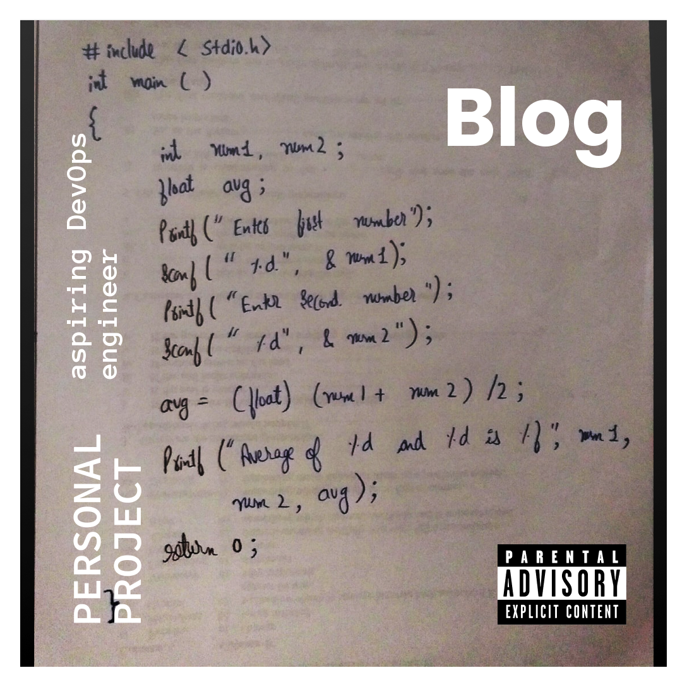

# Meu blog pessoal

Olá! Me chamo Keven e sou estudante de Engenharia da Computação.

Criei este blog para documentar minha jornada de aprendizado, compartilhando sobre tecnologias que estou estudando e projetos pessoais que estou desenvolvendo.

  

Fique à vontade para explorar e acompanhar minhas descobertas! 
